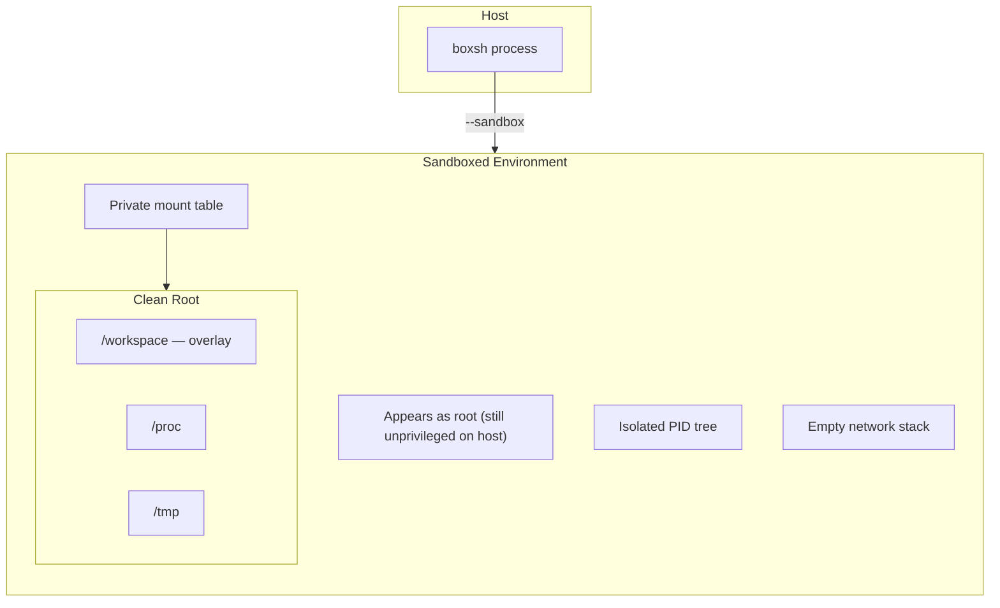
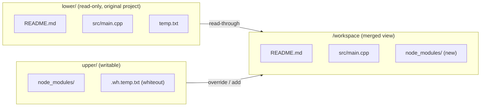
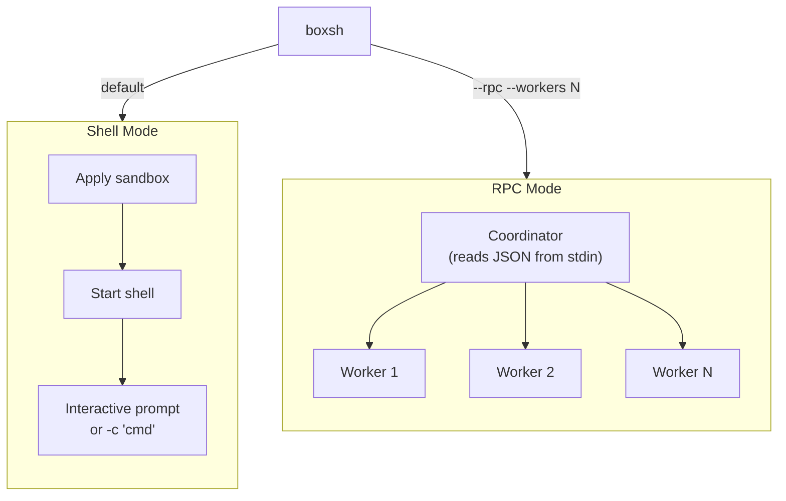
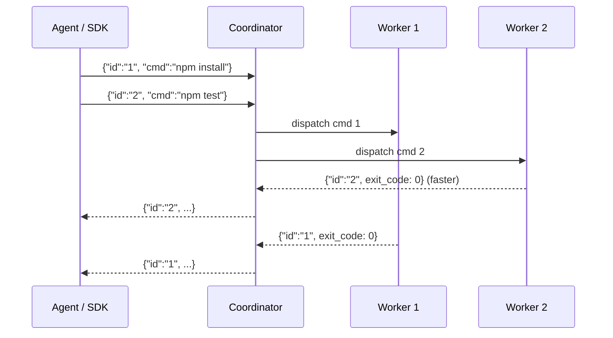

# boxsh Usage Guide

boxsh is a sandboxed POSIX shell with built-in Linux namespace isolation and a programmable JSON-line RPC interface.

It works in two modes: **Shell mode** — a drop-in `/bin/sh` replacement with optional sandboxing and overlay COW; and **RPC mode** — a JSON protocol backend that AI agents, build systems, or orchestration layers can drive programmatically.

This guide walks through the core scenarios boxsh is built for, with concrete examples you can run directly.

---

## Table of Contents

- [How it Works](#how-it-works)
  - [Namespace Sandbox](#namespace-sandbox)
  - [Overlayfs Copy-on-Write](#overlayfs-copy-on-write)
  - [Two Modes](#two-modes)
- [Scenario 1: AI Agent Command Sandbox](#scenario-1-ai-agent-command-sandbox)
- [Scenario 2: Zero-cost Directory Forking](#scenario-2-zero-cost-directory-forking)
- [Scenario 3: Session Checkpointing and Branching](#scenario-3-session-checkpointing-and-branching)
- [Scenario 4: Parallel Isolated Workers](#scenario-4-parallel-isolated-workers)
- [Scenario 5: Deployment / Migration Dry-runs](#scenario-5-deployment--migration-dry-runs)
- [Scenario 6: Isolated Development Shell](#scenario-6-isolated-development-shell)
- [Scenario 7: Agent Interactive Terminal](#scenario-7-agent-interactive-terminal)
- [Reference](#reference)
  - [Installation](#installation)
  - [Shell Mode](#shell-mode)
  - [RPC Mode](#rpc-mode)
  - [Sandbox Flags](#sandbox-flags)
  - [Node.js SDK](#nodejs-sdk)

---

## How it Works

boxsh is a single static binary with a built-in POSIX shell. It uses Linux kernel features — namespaces and overlayfs — to provide process-level filesystem isolation. No root privileges, no Docker, no daemon, no runtime dependencies.

### Namespace Sandbox

When you pass `--sandbox`, boxsh creates an isolated environment for the shell process. From the outside, it's still your normal user process. From the inside, it looks and behaves like a minimal container:

| Capability | What it means for you |
|---|---|
| **User mapping** | You appear as root inside the sandbox, but you're still your normal user on the host. No `sudo` needed. |
| **Private mounts** | Overlay mounts, bind mounts, and tmpfs are visible only inside the sandbox. The host mount table is unaffected. |
| **PID isolation** (`--new-pid-ns`) | The sandbox has its own process tree. Host processes are invisible and cannot be signaled. |
| **Network isolation** (`--new-net-ns`) | The sandbox gets an empty network stack. No outbound connections — `curl`, `wget`, `npm install` (from registry) all fail. |

With `--sandbox` alone, the host root filesystem is still visible — only the mount table is private, so overlay and bind mounts don't affect the host. If you also pass `--rootfs DIR`, boxsh switches the root to a clean tmpfs containing only the mounts you specify (overlays, binds, `/proc`, `/tmp`), and the host root becomes inaccessible.



### Overlayfs Copy-on-Write

The `--overlay` flag mounts a directory with copy-on-write semantics. Your original files serve as a read-only base layer. A separate upper directory captures all modifications:

- **Reads** go straight to the original files — zero copy, zero overhead.
- **Writes** are automatically redirected to the upper directory. The original file is never touched.
- **Deletes** create a marker (whiteout) in the upper directory. The original file remains intact.



No matter how many `npm install`, `make`, or `rm -rf` commands run inside the sandbox, the original directory never changes. All modifications accumulate in the upper directory — you can inspect them with `find upper/` or use the SDK's `getChanges()` to get a structured list of added, modified, and deleted files.

Multiple lower layers are also supported — boxsh uses this to enable session branching (see Scenario 3).

### Two Modes

boxsh operates in two modes for different integration needs:



**Shell mode** is a sandboxed `/bin/sh`. You get an interactive shell (or run a one-liner with `-c`). Good for manual exploration and scripting.

**RPC mode** is for programmatic integration. boxsh reads JSON requests from stdin and writes JSON responses to stdout:

1. You send a request: `{"id":"1", "cmd":"make"}`
2. The coordinator dispatches it to an available worker
3. The worker runs the command and collects stdout/stderr
4. You receive: `{"id":"1", "exit_code":0, "stdout":"..."}`

Multiple workers run in parallel. Responses arrive in completion order, not submission order. File operations (read / write / edit) do not occupy a worker slot.



> Responses arrive as each command finishes — fast commands don't wait for slow ones.

---

## Scenario 1: AI Agent Command Sandbox

**Problem.** You're building an AI agent that generates and runs shell commands — installing packages, editing files, running tests. You need to let it execute arbitrary commands, but you can't let it touch the host filesystem or reach the network. If something goes wrong, you need to throw everything away and start over.

**Conventional approach: Docker.** The standard answer is to run the agent inside a Docker container with a bind-mounted volume:

```sh
docker run --rm --network none -v /home/user/myproject:/workspace ubuntu bash -c 'cd /workspace && npm install'
```

This works, but has real costs:

- **Cold start overhead.** Pulling/building images, launching the container runtime, setting up the network bridge — even a warm start takes 500ms–2s. boxsh starts in under 5ms.
- **Heavy dependency.** Requires dockerd, containerd, and runc. Root or a Docker socket. On CI you need Docker-in-Docker or a privileged runner. boxsh is a static binary with no runtime dependencies.
- **Coarse filesystem isolation.** A bind mount exposes the directory read-write. To protect the host you need a volume copy or a multi-stage setup. With boxsh the overlay is built in — the project is always read-only; writes go to a separate directory automatically.
- **No built-in diff.** After the container exits, you have to diff the volume yourself. boxsh's `getChanges()` (SDK) or `find upper/` gives you the exact list of added, modified, and deleted files.
- **No session branching.** You can't fork a running container into two divergent sessions without committing an image. boxsh branches by stacking overlays (see Scenario 3).

| | Docker | boxsh |
|---|---|---|
| Startup | 500ms–2s (warm) | < 5ms |
| Dependencies | dockerd + containerd + runc | Single static binary |
| Filesystem isolation | Bind mount (manual COW) | Built-in overlay COW |
| Network isolation | Bridge + iptables | `--new-net-ns` (empty network) |
| Diff after run | Manual | `getChanges()` / `find upper/` |
| Session branching | Commit image + new container | Stack overlays |

**Solution.** Give the agent a boxsh instance with `--sandbox`, `--new-net-ns`, and `--overlay`. The agent sees a full working directory it can read and write freely, but every modification lands in a throwaway upper layer. The network is cut off. The host is untouched.

```sh
# Prepare the sandbox workspace
project=/home/user/myproject
sandbox=/tmp/agent-session
mkdir -p "$sandbox"/{upper,work,mnt}

# Start boxsh in RPC mode — the agent talks to this over stdin/stdout
boxsh --rpc --workers 2 --sandbox --new-net-ns \
  --overlay "$project:$sandbox/upper:$sandbox/work:/workspace"
```

Now the agent sends JSON commands:

```json
{"id":"1", "cmd":"cd /workspace && npm install"}
{"id":"2", "cmd":"cd /workspace && npm test"}
```

Inside the sandbox, `/workspace` looks like a complete copy of the project — the agent can `npm install`, create files, delete files, run builds. But:

- **All writes go to `$sandbox/upper/`**. The original project is never modified.
- **Outbound network is blocked** (`--new-net-ns`). The agent can't `curl` or `wget` anything from the internet; `npm install` only works if the packages are already in the overlay.

Add `--new-pid-ns` to also hide the host PID tree, preventing the agent from seeing or signaling other processes.

When the agent finishes, you inspect the upper layer to decide what to keep:

```sh
# See what changed
find "$sandbox/upper" -type f

# Happy with the result? Copy it back
cp -a "$sandbox/upper/." "$project/"

# Not happy? Discard everything
rm -rf "$sandbox"
```

**With the Node.js SDK**, the same workflow looks like:

```js
import { BoxshClient, getChanges, formatChanges } from 'boxsh.js';
import fs from 'node:fs';

const sandbox = '/tmp/agent-session';
fs.mkdirSync(`${sandbox}/upper`, { recursive: true });
fs.mkdirSync(`${sandbox}/work`,  { recursive: true });
fs.mkdirSync(`${sandbox}/mnt`,   { recursive: true });

const client = new BoxshClient({
    sandbox: true,
    newNetNs: true,
    overlay: {
        lower: '/home/user/myproject',
        upper: `${sandbox}/upper`,
        work:  `${sandbox}/work`,
        dst:   '/workspace',
    },
});

await client.exec('npm install', '/workspace');
await client.exec('npm test',    '/workspace');

// Use built-in file tools — no shell round-trip needed
const pkg = await client.read('/workspace/package.json');
await client.write('/workspace/notes.txt', 'Agent completed run.\n');
await client.edit('/workspace/config.js', [
    { oldText: 'DEBUG = false', newText: 'DEBUG = true' },
]);

await client.close();

// Inspect what the agent actually changed
const changes = getChanges({ upper: `${sandbox}/upper`, base: '/home/user/myproject' });
console.log(formatChanges(changes));
// M  package-lock.json
// A  node_modules/
// A  notes.txt
// M  config.js
```

---

## Scenario 2: Zero-cost Directory Forking

**Problem.** You want to experiment with a directory — run a build, install dependencies, modify config files — without actually changing anything. Git stash doesn't work because untracked files get lost, and `cp -a` is too slow for large trees.

**Conventional approaches:**

| Approach | Downsides |
|---|---|
| `cp -a` | O(n) time and disk — copying a 10 GB tree takes minutes and doubles disk usage |
| `git stash` / `git checkout -b` | Only tracks git-managed files; untracked files, node_modules, build artifacts are invisible |
| `btrfs subvolume snapshot` | Requires btrfs filesystem; not available on ext4, xfs, or cloud VMs with EBS |
| `rsync --link-dest` | Hard links break COW semantics — a write to one copy silently modifies the other |
| Docker volume | Requires container runtime; coarse granularity; no inline diff |

All of these either copy data (slow, wasteful) or require a specific filesystem/tool.

**Solution with boxsh.** Mount the directory as the lower layer of an overlay. Reads go straight to the original files (zero copy). Writes land in a separate upper directory. The original directory is never touched.

```sh
# "Fork" a 10 GB sysroot in zero time
base=/opt/sysroot
upper=/tmp/experiment/upper
work=/tmp/experiment/work
mnt=/tmp/experiment/mnt
mkdir -p "$upper" "$work" "$mnt"

boxsh --sandbox --overlay "$base:$upper:$work:$mnt" -c '
    # Install a package "experimentally"
    cd /tmp/experiment/mnt
    make install PREFIX=/tmp/experiment/mnt/usr
    echo "Installed files:"
    find /tmp/experiment/mnt/usr -type f
'

# The original /opt/sysroot is completely untouched
# All installed files are physically in $upper/usr/
```

This works for **any directory** — it's not limited to git repos. You can fork a Python venv, a Docker layer, a database data directory, or a compiled build tree.

**Key point:** Reading 100,000 files from the base layer costs nothing extra — they are served directly from the original directory. Only files you actually modify consume additional disk space.

---

## Scenario 3: Session Checkpointing and Branching

**Problem.** An agent has been working for 20 minutes — installing packages, editing files, running tests. You want to save this state, try two different approaches from here, and compare the results. Or you want to roll back to a known-good point if the next step fails.

**Conventional approaches:**

| Approach | Downsides |
|---|---|
| `git branch` + `git stash` | Only covers tracked files; ignores node_modules, build artifacts, .env files. Creating a branch doesn't snapshot the working tree — you have to commit or stash first, and stash doesn't stack cleanly for multiple branches. |
| VM snapshot (VirtualBox, QEMU) | Full machine snapshot — GB-scale, takes seconds to minutes. Restoring means rebooting the VM. Cannot branch two snapshots and run them simultaneously. |
| Docker commit + run | `docker commit` creates a new image layer, then `docker run` starts a new container. Heavyweight: each commit is a full layer, and you can't share writable state between two forked containers. |
| `cp -a` the working directory | O(n) copy. For a 5 GB directory with 200K files, this takes minutes. Two branches = two full copies = 10 GB extra disk. |
| Filesystem snapshot (btrfs/ZFS) | Fast, but requires a specific filesystem. Not available on ext4, xfs, or typical cloud VMs. |

**Solution with boxsh.** overlayfs can be stacked. The current session's upper layer becomes the read-only lower layer for the next level. The original session is untouched — you just create new overlays on top of it.

### How it works

Suppose session A is running with this layout:

```
base (your project, read-only)
  └── upper_a (session A's modifications)
```

You want to branch into two new sessions without disturbing session A. Stop the boxsh process, then stack two new overlays on top of `upper_a`:

```
base (read-only)
  └── upper_a (session A, now frozen as lower layer)
        ├── upper_a1 (branch A1 — new writes go here)
        └── upper_b  (branch B  — new writes go here)
```

Both branches see the full state of session A, but new writes go to their own upper directories. Session A's `upper_a` is never modified again.

### Branching in practice

```sh
# Session A has been running with:
#   --overlay "$project:$session/upper_a:$session/work_a:/workspace"
# Stop the boxsh process. upper_a now contains all of A's modifications.

project=/home/user/myproject
session=/tmp/agent-session

# Create new upper/work dirs for each branch
mkdir -p "$session"/{upper_a1,work_a1,upper_b,work_b}

# Branch A1: continues where A left off
# LOWER = "upper_a:project" — overlayfs merges both layers, upper_a on top
boxsh --rpc --sandbox \
  --overlay "$session/upper_a:$project:$session/upper_a1:$session/work_a1:/workspace" &
pid_a1=$!

# Branch B: also continues where A left off
boxsh --rpc --sandbox \
  --overlay "$session/upper_a:$project:$session/upper_b:$session/work_b:/workspace" &
pid_b=$!

# Send different commands to each branch...
# Branch A1: try lodash
echo '{"id":"1","cmd":"cd /workspace && npm install lodash"}' \
  > /proc/$pid_a1/fd/0

# Branch B: try underscore
echo '{"id":"1","cmd":"cd /workspace && npm install underscore"}' \
  > /proc/$pid_b/fd/0
```

After both branches finish, compare:

```sh
diff <(find "$session/upper_a1" -type f | sort) \
     <(find "$session/upper_b"  -type f | sort)
```

`upper_a` is completely untouched. You can branch again from it, or resume session A by creating yet another overlay on top of it.

### Rolling back

Rolling back is just discarding the branch's upper directory and creating a fresh one:

```sh
# Branch A1 went wrong — discard and retry
rm -rf "$session/upper_a1" "$session/work_a1"
mkdir -p "$session/upper_a1" "$session/work_a1"
# Restart boxsh with the same overlay — back to session A's state
```

### Saving a checkpoint

You can also archive a session's upper layer for long-term storage:

```sh
tar czf checkpoint-a.tar.gz -C "$session/upper_a" .
```

Restore later by extracting into a new directory and using it as a lower layer.

---

## Scenario 4: Parallel Isolated Workers

**Problem.** You have a large read-only tree — a `node_modules` directory, a Python virtual environment, a compiled sysroot — and you want to run multiple tasks against it concurrently. Each task might write temp files, modify configs, or produce build artifacts. They must not interfere with each other.

**Conventional approach: `git worktree`.** Git worktree creates a separate working directory linked to the same repository. Each worktree gets its own checkout:

```sh
git worktree add ../build-x86    main
git worktree add ../build-aarch64 main
git worktree add ../test-suite   main
```

This works, but has real limitations:

- **Slow for large repos.** Each worktree is a full checkout — for a 2 GB monorepo, creating 8 worktrees takes minutes and consumes 16 GB of disk.
- **Git-only.** Doesn't work on non-git directories — `node_modules`, Python venvs, compiled sysroots, database data directories.
- **Cleanup required.** Worktrees must be removed with `git worktree remove`; stale worktrees accumulate and confuse tooling.
- **No write isolation between workers.** Two worktrees on the same branch can write to shared git state (index, refs) and conflict.

**Solution with boxsh.** Share one read-only base across all workers via overlay. Each worker gets its own copy-on-write view — no data is duplicated. Only files that a worker actually modifies consume additional disk space.

| | `git worktree` | boxsh overlay |
|---|---|---|
| Setup time | Full checkout per worktree | Instant (kernel mount) |
| Disk cost | Full copy per worktree | Only modified files |
| Works on non-git dirs | No | Yes |
| Write isolation | Shared git state | Complete (per-process COW) |
| Cleanup | `git worktree remove` | `rm -rf upper/` |

```sh
# 8 workers, all sharing the same base, each with COW semantics
boxsh --rpc --workers 8 --sandbox \
  --overlay "/opt/sysroot:/tmp/parallel/upper:/tmp/parallel/work:/sysroot"
```

Send 8 requests at once — they execute in parallel:

```sh
printf '%s\n' \
  '{"id":"test-1", "cmd":"cd /sysroot && make test SUITE=unit"}' \
  '{"id":"test-2", "cmd":"cd /sysroot && make test SUITE=integration"}' \
  '{"id":"test-3", "cmd":"cd /sysroot && make test SUITE=e2e"}' \
  '{"id":"build-1","cmd":"cd /sysroot && make build ARCH=x86_64"}' \
  '{"id":"build-2","cmd":"cd /sysroot && make build ARCH=aarch64"}' \
  '{"id":"lint",   "cmd":"cd /sysroot && make lint"}' \
  '{"id":"docs",   "cmd":"cd /sysroot && make docs"}' \
  '{"id":"bench",  "cmd":"cd /sysroot && make bench"}' \
| boxsh --rpc --workers 8 --sandbox \
    --overlay "/opt/sysroot:/tmp/parallel/upper:/tmp/parallel/work:/sysroot"
```

Responses stream back as each task finishes — fast tasks don't wait for slow ones. If a worker crashes (OOM, timeout), the coordinator respawns it automatically and returns an error response for that request only. Other workers are unaffected.

**With the Node.js SDK:**

```js
import { BoxshClient } from 'boxsh.js';

const client = new BoxshClient({
    workers: 8,
    sandbox: true,
    overlay: {
        lower: '/opt/sysroot',
        upper: '/tmp/parallel/upper',
        work:  '/tmp/parallel/work',
        dst:   '/sysroot',
    },
});

const results = await Promise.all([
    client.exec('make test SUITE=unit',        '/sysroot'),
    client.exec('make test SUITE=integration', '/sysroot'),
    client.exec('make test SUITE=e2e',         '/sysroot'),
    client.exec('make build ARCH=x86_64',      '/sysroot'),
    client.exec('make build ARCH=aarch64',     '/sysroot'),
]);

for (const r of results) {
    console.log(`exit: ${r.exitCode}`);
}

await client.close();
```

---

## Scenario 5: Deployment / Migration Dry-runs

**Problem.** You want to run `make install`, a package upgrade, or a database migration, but you need to see exactly which files will be created, modified, or deleted **before** committing the change. Rolling back a failed migration is painful; previewing it is free.

**Conventional approaches:**

| Approach | Downsides |
|---|---|
| `make install DESTDIR=/tmp/staging` | Only works if the Makefile respects DESTDIR. Many build systems, scripts, and package managers hard-code paths. Database migrations don't have a DESTDIR equivalent at all. |
| `apt-get --simulate` / `dnf --assumeno` | Simulation only — tells you what **would** happen but doesn't actually run post-install scripts, config file merges, or triggers. The real result can differ from the preview. |
| LVM snapshot + rollback | Creates a block-level snapshot of the entire volume. Works, but: requires LVM setup, the snapshot degrades I/O performance, and you have to reboot or remount to roll back. Not practical on cloud VMs with EBS/managed disks. |
| Docker: build a test image | `COPY . /app && RUN make install` in a Dockerfile. Gives you a diff via `docker diff`, but requires dockerd, an image build, and doesn't easily let you compare the result to the host filesystem. |
| VM snapshot | Same as LVM but even heavier — snapshot the entire machine, try the operation, revert if it fails. Minutes of downtime. |

**Solution with boxsh.** Run the operation on an overlay. The original filesystem is read-only. After the operation completes, inspect the upper layer to see every file that was touched.

### Preview a `make install`

```sh
mkdir -p /tmp/dryrun/{upper,work,mnt}

echo '{"id":"1","cmd":"make install PREFIX=/system/usr"}' \
| boxsh --rpc --sandbox \
    --overlay "/:/tmp/dryrun/upper:/tmp/dryrun/work:/system"

# What would be installed?
echo "--- Files that would be created or modified ---"
find /tmp/dryrun/upper -type f | sed 's|^/tmp/dryrun/upper||'
```

### Preview a package upgrade

```sh
mkdir -p /tmp/upgrade/{upper,work,mnt}

echo '{"id":"1","cmd":"apt-get install -y --simulate nginx 2>&1; dpkg --configure -a"}' \
| boxsh --rpc --sandbox \
    --overlay "/:/tmp/upgrade/upper:/tmp/upgrade/work:/"

# Inspect exactly which config files, binaries, and libraries would change
find /tmp/upgrade/upper -type f | head -20
```

### Approve or discard

The workflow always ends the same way:

```sh
# Option A: looks good — apply for real
cp -a /tmp/dryrun/upper/. /

# Option B: something's wrong — throw it away
rm -rf /tmp/dryrun
```

No rollback mechanism needed. The change never happened until you explicitly copy it.

This scenario also works well in **shell mode** — run the operation directly without RPC:

```sh
mkdir -p /tmp/dryrun/{upper,work}

boxsh --sandbox --overlay "/:$PWD/upper:$PWD/work:/system" -c '
    make install PREFIX=/system/usr
'

# Inspect what would have been installed
find /tmp/dryrun/upper -type f | sed 's|^/tmp/dryrun/upper||'
```

**With the Node.js SDK:**

```js
import { BoxshClient, getChanges, formatChanges } from 'boxsh.js';

const client = new BoxshClient({
    sandbox: true,
    overlay: {
        lower: '/',
        upper: '/tmp/dryrun/upper',
        work:  '/tmp/dryrun/work',
        dst:   '/system',
    },
});

await client.exec('make install PREFIX=/system/usr');
await client.close();

// Inspect what would change
const changes = getChanges({ upper: '/tmp/dryrun/upper', base: '/' });
console.log(formatChanges(changes));
// A  usr/bin/myapp
// A  usr/lib/libmyapp.so
// A  usr/share/man/man1/myapp.1.gz
```

---

## Scenario 6: Isolated Development Shell

**Problem.** You want to experiment in a project — try a different build configuration, install an experimental package, run a destructive migration script — without setting up any tooling or worrying about cleanup. You just want to open a shell, do whatever you want, and walk away without consequences.

**Conventional approaches:**

| Approach | Downsides |
|---|---|
| Docker interactive shell (`docker run -it -v ...`) | Needs dockerd running, 500ms–2s startup, different userland (Ubuntu/Alpine inside vs host), file ownership mismatches on bind-mounted volumes |
| `distrobox` / `toolbox` | Container-based (requires podman/docker), designed for persistent managed environments — not throwaway sandboxes. Installing one is a multi-step process. |
| `chroot` | Requires root, no COW — you must manually copy the filesystem tree. No mount/network/PID isolation. |
| `firejail` / `bubblewrap` | Security-focused; complex profile/policy files to get overlay + network right. Not designed as an interactive development shell. |
| Git branch + stash | Only covers tracked files. `node_modules/`, build artifacts, `.env`, database files are all invisible to git. |

**Solution with boxsh.** Open an interactive sandboxed shell with overlay in one command:

```sh
mkdir -p /tmp/dev/{upper,work}

boxsh --sandbox --overlay "$PWD:/tmp/dev/upper:/tmp/dev/work:/workspace"
```

You land in an interactive shell with line editing (libedit). `/workspace` is a COW view of your project — you can read everything, and every write goes to `/tmp/dev/upper`. The host project directory is never modified.

```sh
# Inside the sandboxed shell
cd /workspace
npm install           # node_modules goes to upper, not your real project
vim config.js         # edits land in upper
make build            # build artifacts go to upper
rm -rf src/           # original src/ is untouched — only a whiteout is created in upper
```

When you exit the shell, inspect and decide:

```sh
# See what you did
find /tmp/dev/upper -type f

# Keep it? Copy back.
cp -a /tmp/dev/upper/. "$PWD/"

# Discard it? One command.
rm -rf /tmp/dev
```

Add `--new-net-ns` to block outbound network, `--new-pid-ns` to hide host processes:

```sh
boxsh --sandbox --new-net-ns --new-pid-ns \
  --overlay "$PWD:/tmp/dev/upper:/tmp/dev/work:/workspace"
```

**Why this beats the alternatives:**

- **Zero startup overhead.** Under 5ms. No image pull, no container runtime.
- **Same userland.** You're running the host's files directly, not a different distro inside a container. Your tools, paths, and libraries are all there.
- **Throwaway by default.** No cleanup commands needed — `rm -rf /tmp/dev` and it's as if nothing happened.
- **Works on any directory.** Not limited to git repos. Fork a Python venv, a compiled sysroot, a database data directory.

---

## Scenario 7: Agent Interactive Terminal

**Problem.** You're building an AI agent that needs a real interactive terminal — not just a request/response API. The agent needs to handle interactive programs (vim, python REPL, top), respond to prompts ("Are you sure? [y/n]"), and maintain shell state across commands (environment variables, working directory, shell functions). But you can't let the agent touch the host system.

**Conventional approaches:**

| Approach | Downsides |
|---|---|
| Docker exec with PTY (`docker exec -it`) | Needs a running container + dockerd. Cold start is slow. Agent must manage container lifecycle. No built-in COW for the workspace. |
| SSH into a VM | Minutes to provision. Per-VM cost. Heavy for a throwaway session. |
| `screen` / `tmux` in a chroot | Fragile multi-step setup. No mount/network/PID isolation. No COW. |
| Spawn `/bin/sh` with PTY | No isolation at all — agent can `rm -rf /`, `curl` arbitrary URLs, kill host processes. |

**Solution with boxsh.** Allocate a PTY and connect it to boxsh with sandbox + overlay. The agent gets a real interactive shell session — tab completion, job control, signal handling — inside a fully isolated namespace.

```python
import subprocess, os, pty

# Create a PTY pair
parent_fd, child_fd = pty.openpty()

proc = subprocess.Popen(
    ['boxsh', '--sandbox', '--new-net-ns',
     '--overlay', f'{project}:{upper}:{work}:/workspace'],
    stdin=child_fd, stdout=child_fd, stderr=child_fd,
    preexec_fn=os.setsid,
)
os.close(child_fd)

# Agent interacts via parent_fd — reads output, writes commands
os.write(parent_fd, b'cd /workspace && ls\n')
output = os.read(parent_fd, 4096)

os.write(parent_fd, b'npm install\n')
# ... read output, parse, decide next action ...

os.write(parent_fd, b'exit\n')
proc.wait()
os.close(parent_fd)
```

Or for simpler non-interactive use, pipe commands directly:

```sh
# Agent sends commands one at a time, reads stdout/stderr
boxsh --sandbox --overlay "$project:$upper:$work:/workspace" -c '
    cd /workspace
    npm install
    npm test
'
```

**What the agent gets:**

- A real POSIX shell with full syntax: pipes, redirections, variables, functions, subshells
- Shell state persists across commands (cd, export, aliases)
- Interactive programs work (python REPL, less, vi) when connected via PTY
- The host filesystem is read-only — all writes land in the overlay upper layer
- Network is isolated (with `--new-net-ns`) — no exfiltration risk
- PID tree is hidden (with `--new-pid-ns`) — agent cannot see or kill host processes

**When to use Shell mode vs RPC mode:**

| | Shell Mode | RPC Mode |
|---|---|---|
| Protocol | stdin/stdout text stream | JSON-line structured messages |
| Concurrency | Sequential (one command at a time) | Parallel (multi-worker) |
| Output format | Raw text (agent must parse) | Structured JSON with exit code, duration |
| Interactive programs | Yes (with PTY) | No |
| Shell state | Persists (cd, export, aliases) | Isolated per command |
| Built-in file tools | No | read / write / edit |
| Best for | Interactive sessions, stateful workflows | Programmatic automation, parallel execution |

---

## Reference

### Installation

Build from source (requires CMake ≥ 3.16, GCC or Clang with C11/C++17, Linux kernel ≥ 3.8):

```sh
cmake -B build
cmake --build build
```

The resulting binary is `build/boxsh`. Copy it anywhere on your `$PATH`.

### Shell Mode

By default boxsh acts as a drop-in POSIX shell:

```sh
# Interactive shell with line editing (libedit)
boxsh

# Run a command string
boxsh -c 'echo hello world'

# Run a script
boxsh script.sh arg1 arg2

# Pipe input
echo 'ls -la' | boxsh
```

All dash features work: pipelines, redirections, variables, arithmetic, heredocs, etc.

### RPC Mode

RPC mode turns boxsh into a programmable backend. It reads newline-delimited JSON requests from stdin and writes JSON responses to stdout.

```sh
boxsh --rpc [--workers N] [sandbox flags...]
```

- `--workers N` — number of parallel workers (default: 4)
- Responses arrive in **completion order**, not submission order

#### Shell Commands

Send a shell command with a `cmd` field:

```sh
echo '{"id":"1", "cmd":"echo hello"}' | boxsh --rpc
```

**Request:**

| Field | Type | Required | Description |
|---|---|---|---|
| `id` | string | no | Echoed back in the response |
| `cmd` | string | yes | Shell command (parsed by embedded dash) |
| `timeout` | number | no | Kill after N seconds (0 = no limit) |

**Response:**

```json
{"id":"1", "exit_code":0, "stdout":"hello\n", "stderr":"", "duration_ms":3}
```

| Field | Type | Description |
|---|---|---|
| `id` | string | Echoed from request |
| `exit_code` | number | Exit status (128+signal if killed) |
| `stdout` | string | Captured standard output |
| `stderr` | string | Captured standard error |
| `duration_ms` | number | Wall-clock time in milliseconds |
| `error` | string | Present only on failure (parse error, worker crash) |

Full shell syntax is supported — pipes, redirections, variables, subshells, etc.:

```sh
echo '{"id":"1", "cmd":"echo hello | tr a-z A-Z"}' | boxsh --rpc
# {"id":"1","exit_code":0,"stdout":"HELLO\n","stderr":"","duration_ms":4}

echo '{"id":"2", "cmd":"x=42; echo $((x * 2))"}' | boxsh --rpc
# {"id":"2","exit_code":0,"stdout":"84\n","stderr":"","duration_ms":3}
```

#### Built-in Tools

Three file-operation tools are available. They do not occupy a worker slot, so you can use them freely alongside shell commands. Use `tool` instead of `cmd`.

**Common response format:**

```json
{"id":"1", "content":[{"type":"text","text":"..."}], "details":{...}}
```

On error: `{"id":"1", "error":"message"}`.

**read** — Read a file, optionally restricting to a line range.

```sh
# Read entire file
echo '{"id":"1", "tool":"read", "path":"/etc/hostname"}' | boxsh --rpc

# Read lines 10–19
echo '{"id":"1", "tool":"read", "path":"src/main.cpp", "offset":10, "limit":10}' | boxsh --rpc
```

| Field | Type | Default | Description |
|---|---|---|---|
| `offset` | number | 1 | 1-based start line |
| `limit` | number | unlimited | Maximum lines to return |

Response includes truncation info:

```json
{"id":"1", "content":[{"type":"text","text":"..."}], "details":{"truncation":{"truncated":false,"line_count":24}}}
```

**write** — Create or overwrite a file.

```sh
echo '{"id":"1", "tool":"write", "path":"/tmp/hello.txt", "content":"hello\n"}' | boxsh --rpc
# {"id":"1","content":[{"type":"text","text":"written 6 bytes"}]}
```

**edit** — Apply one or more search-and-replace operations on a file.

```sh
echo '{
  "id":"1", "tool":"edit", "path":"config.ini",
  "edits":[
    {"oldText":"debug = false", "newText":"debug = true"},
    {"oldText":"port = 3000",   "newText":"port = 8080"}
  ]
}' | boxsh --rpc
```

Rules:

- Each `oldText` must appear **exactly once** in the original file
- All matches are found against the **original** content, not intermediate results
- Edits must not overlap
- `oldText` must not be empty

The response includes a unified diff and the first changed line number:

```json
{
  "id":"1",
  "content":[{"type":"text","text":"OK"}],
  "details":{"diff":"--- a/config.ini\n+++ b/config.ini\n@@ ...", "firstChangedLine":3}
}
```

#### Concurrency

Multiple requests sent at once are dispatched to different workers and execute in parallel:

```sh
printf '%s\n' \
  '{"id":"slow", "cmd":"sleep 0.5; echo slow"}' \
  '{"id":"fast", "cmd":"echo fast"}' \
| boxsh --rpc --workers 2
```

Output (fast completes first):

```
{"id":"fast","exit_code":0,"stdout":"fast\n","stderr":"","duration_ms":3}
{"id":"slow","exit_code":0,"stdout":"slow\n","stderr":"","duration_ms":503}
```

Tool requests and shell commands can be interleaved — tools do not occupy a worker.

#### Timeout

Set a per-request timeout in seconds. When the timeout fires, the command is killed and the worker is respawned automatically.

```sh
echo '{"id":"t", "cmd":"sleep 60", "timeout":2}' | boxsh --rpc
# Response after ~2 seconds:
# {"id":"t","exit_code":-1,"stderr":"timeout","duration_ms":2001}
```

Subsequent requests continue to work normally — the crashed worker is replaced transparently.

### Sandbox Flags

Pass `--sandbox` to enable sandbox isolation. Inside the sandbox, you appear as root.

```sh
# Basic sandbox
boxsh --sandbox -c 'whoami'
# root

# Isolate network (loopback only, no outbound access)
boxsh --sandbox --new-net-ns -c 'curl http://example.com'
# curl: (6) Could not resolve host: example.com

# Isolate PID tree (host processes not visible)
boxsh --sandbox --new-pid-ns -c 'ps aux'
```

In RPC mode, each worker runs inside the sandbox — all commands share the same isolated environment:

```sh
boxsh --rpc --workers 4 --sandbox --new-net-ns
```

| Flag | Effect |
|---|---|
| `--sandbox` | Enable sandbox isolation |
| `--no-user-ns` | Skip user namespace (requires root for other namespaces) |
| `--new-net-ns` | Loopback-only network |
| `--new-pid-ns` | Isolated PID tree |

#### Overlay Filesystem

Overlay is the primary usage pattern for boxsh. It mounts a read-only base directory as a copy-on-write workspace. Commands can read and write freely; all modifications land in the upper directory while the base remains untouched.

```
--overlay LOWER:UPPER:WORK:DST
```

| Parameter | Description |
|---|---|
| `LOWER` | Read-only base directory (e.g. your project root) |
| `UPPER` | Writable upper directory (all modifications accumulate here) |
| `WORK` | Working directory for overlayfs metadata (same filesystem as UPPER) |
| `DST` | Mount point visible inside the sandbox |

All four directories must exist before starting boxsh.

**Example — run `npm install` without touching the real project:**

```sh
# Prepare directories
project=/home/user/myproject
upper=/tmp/sandbox/upper
work=/tmp/sandbox/work
mnt=/tmp/sandbox/mnt
mkdir -p "$upper" "$work" "$mnt"

# Run inside overlay
echo '{"id":"1","cmd":"cd /workspace && npm install"}' \
| boxsh --rpc --sandbox --overlay "$project:$upper:$work:/workspace"

# Base is untouched; all changes are in $upper
ls "$upper"
# node_modules/  package-lock.json
```

The upper directory **persists** across commands within the same boxsh session, and even across sessions if you reuse the same directories. To discard all changes, simply `rm -rf "$upper" "$work"`.

**Kernel requirements:**

- `CONFIG_OVERLAY_FS=y/m`
- Inside user namespaces (the default): `CONFIG_OVERLAY_FS_METACOPY=y` (Linux ≥ 5.11)

#### Bind Mounts

Expose specific host paths inside the sandbox:

```sh
# Read-write bind
boxsh --sandbox --bind /data:/data -c 'ls /data'

# Read-only bind
boxsh --sandbox --bind /etc/resolv.conf:/etc/resolv.conf:ro -c 'cat /etc/resolv.conf'
```

Format: `--bind SRC:DST[:ro]`

#### Custom Root Filesystem

Build a minimal root filesystem with `--rootfs`, `--proc`, and `--tmpfs`:

```sh
boxsh --sandbox \
  --rootfs /path/to/sysroot \
  --bind /usr:/usr:ro \
  --proc /proc \
  --tmpfs /tmp \
  --ro-root \
  -c 'ls /'
```

| Flag | Effect |
|---|---|
| `--rootfs DIR` | Use DIR as the new root filesystem |
| `--proc DST` | Mount procfs at DST |
| `--tmpfs DST[:OPTS]` | Mount empty tmpfs at DST (e.g. `--tmpfs /tmp:size=128m`) |
| `--ro-root` | Remount `/` read-only after pivot |

### Node.js SDK

The `boxsh.js` SDK provides a high-level client for Node.js applications.

```sh
npm install ./sdk/js
```

#### Quick start

```js
import { BoxshClient } from 'boxsh.js';

const client = new BoxshClient();
const { exitCode, stdout } = await client.exec('echo hello');
console.log(stdout);  // "hello\n"
await client.close();
```

#### Overlay workflow

```js
import { BoxshClient, getChanges, formatChanges } from 'boxsh.js';
import fs from 'node:fs';

const upper = '/tmp/sandbox/upper';
const work  = '/tmp/sandbox/work';
const mnt   = '/tmp/sandbox/mnt';
fs.mkdirSync(upper, { recursive: true });
fs.mkdirSync(work,  { recursive: true });
fs.mkdirSync(mnt,   { recursive: true });

const client = new BoxshClient({
    sandbox: true,
    overlay: { lower: '/home/user/myproject', upper, work, dst: mnt },
});

// Run commands inside the sandbox
await client.exec('npm install', mnt);

// Read/write files via built-in tools (no shell round-trip)
const pkg = await client.read(`${mnt}/package.json`);
await client.write(`${mnt}/notes.txt`, 'done\n');

// Edit files with search-and-replace
const { diff } = await client.edit(`${mnt}/config.js`, [
    { oldText: 'DEBUG = false', newText: 'DEBUG = true' },
]);
console.log(diff);

await client.close();

// Inspect what changed
const changes = getChanges({ upper, base: '/home/user/myproject' });
console.log(formatChanges(changes));
// M  package-lock.json
// A  node_modules/
// A  notes.txt
```

#### Concurrent execution

Run multiple commands in parallel with multiple workers:

```js
import { BoxshClient } from 'boxsh.js';

const client = new BoxshClient({ workers: 4 });

const [a, b, c] = await Promise.all([
    client.exec('make build',  '/workspace'),
    client.exec('make lint',   '/workspace'),
    client.exec('make test',   '/workspace'),
]);

await client.close();
```

#### Constructor options

| Option | Type | Default | Description |
|---|---|---|---|
| `boxshPath` | `string` | `$BOXSH` → `'boxsh'` | Path to boxsh binary |
| `workers` | `number` | `1` | Parallel worker count |
| `sandbox` | `boolean` | `false` | Enable namespace isolation |
| `newNetNs` | `boolean` | `false` | Isolate network |
| `newPidNs` | `boolean` | `false` | Isolate PID tree |
| `overlay` | `{ lower, upper, work, dst }` | — | Overlay mount config |

#### Methods

| Method | Returns | Description |
|---|---|---|
| `exec(cmd, cwd?, timeout?)` | `{ exitCode, stdout, stderr }` | Run a shell command |
| `read(path, offset?, limit?)` | `string` | Read file content |
| `write(path, content)` | `void` | Write/overwrite a file |
| `edit(path, edits)` | `{ diff, firstChangedLine }` | Search-and-replace edit |
| `close()` | `void` | Graceful shutdown |
| `terminate()` | `void` | Kill immediately |

#### Utility functions

| Function | Description |
|---|---|
| `shellQuote(s)` | POSIX single-quote escaping for safe command interpolation |
| `getChanges({ upper, base })` | Scan overlay upper dir for added/modified/deleted files |
| `formatChanges(changes)` | Format change list as `A/M/D\tpath` text |
